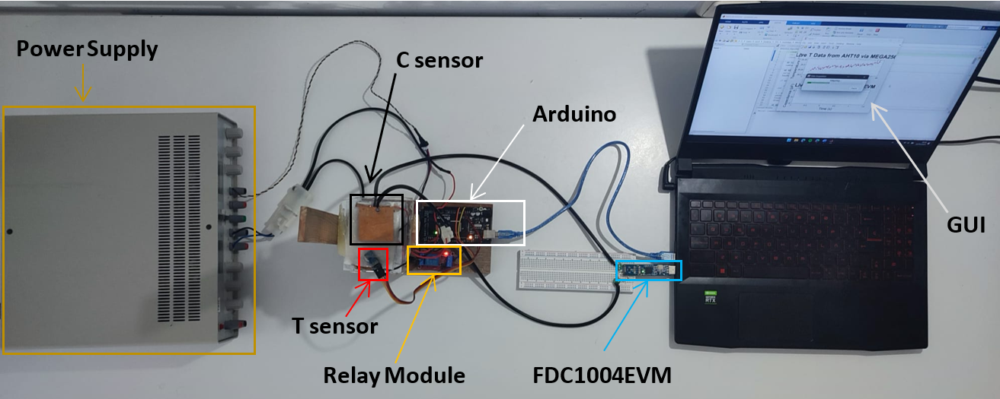
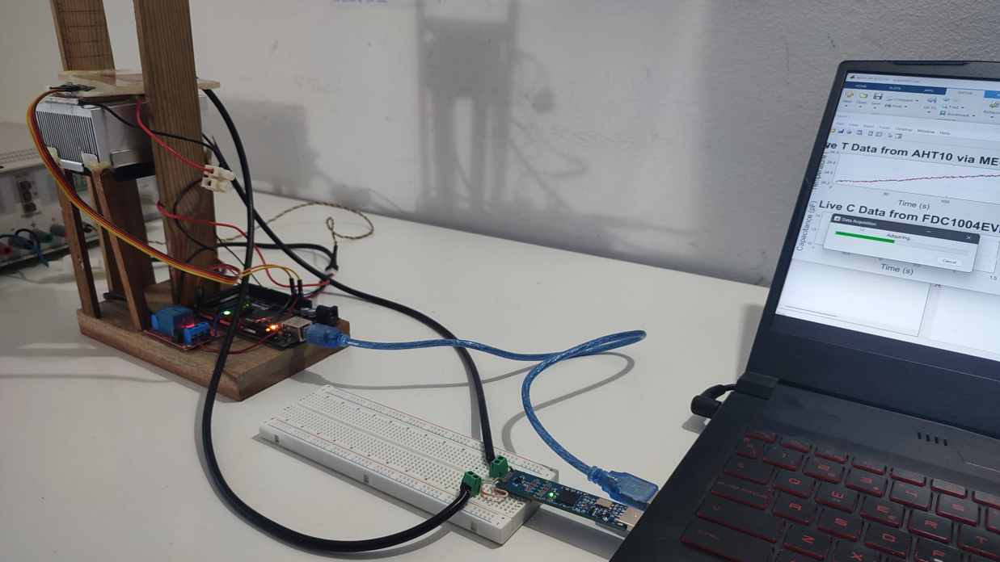

# Pre-Freeze Capacitance Detection System – Final Documentation

This repository contains all the necessary documentation to understand, reproduce, and build the final version of the **Pre-Freeze Capacitance Detection System**.  

- Hardware setup and wiring diagrams
- PCB and enclosure designs
- Firmware and data acquisition scripts
- Experimental results and analysis

## System Views

### 🔹 Top View

### 🔹 Isometric View

> 📸 Images are located in the repository folder.

## Author

Nicolau Solé Coves  
Biomedical Engineering & Industrial Electronics – EEBE - UPC  

